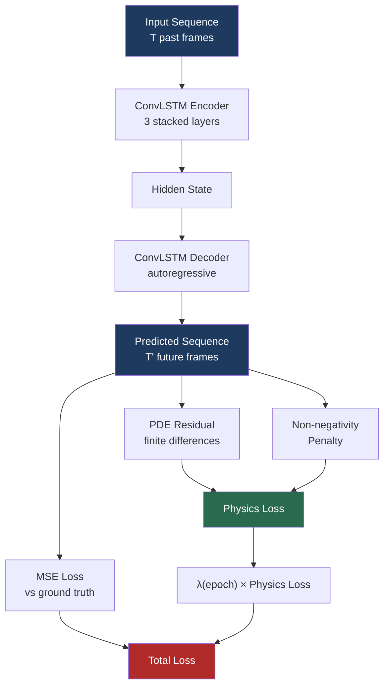
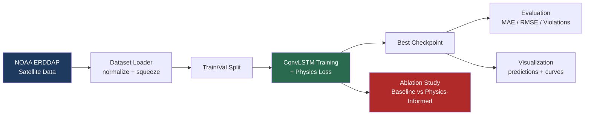

<div align="center">

# 🌊 Physics-Informed ConvLSTM for Satellite Climate Prediction

**Constraining deep learning with physical laws for more trustworthy climate forecasts**

[](https://www.python.org/)
[](https://pytorch.org/)
[](LICENSE)
[](https://www.ncei.noaa.gov/products/optimum-interpolation-sst)

*A hybrid deep learning system that predicts sea surface temperature from satellite time-series data — constrained by real physics (advection-diffusion PDEs) so the model can't predict physically impossible outcomes.*

<!-- 🖼️ PLACEHOLDER: Hero/banner image (AI-generated) -->
<!--  -->

</div>

---

## 📑 Table of Contents

1. [Overview](#-overview)
2. [Problem & Motivation](#-problem--motivation)
3. [Features](#-features)
4. [Architecture & Workflow](#-architecture--workflow)
5. [Tech Stack](#-tech-stack)
6. [Project Structure](#-project-structure)
7. [Setup & Usage](#-setup--usage)
8. [Examples](#-examples)
9. [Results & Evaluation](#-results--evaluation)
10. [Testing](#-testing)
11. [Limitations](#-limitations)
12. [Lessons Learned](#-lessons-learned)
13. [Future Improvements / Roadmap](#-future-improvements--roadmap)
14. [License & Acknowledgments](#-license--acknowledgments)

---

## 🎯 Overview

Purely data-driven CNNs and ConvLSTMs are powerful at spatiotemporal pattern matching, but they have no built-in concept of physical law. Left unconstrained, they can predict outcomes that violate basic physics — negative rainfall, spontaneous energy creation, or discontinuous jumps that no real fluid system would produce.

This project injects a physical constraint directly into the training loss of a ConvLSTM forecasting model trained on **real NOAA satellite sea surface temperature (SST) data**:

$$\mathcal{L}_{\text{total}} = \mathcal{L}_{\text{MSE}} + \lambda \, \mathcal{L}_{\text{physics}}$$

where $\mathcal{L}_{\text{physics}}$ penalizes violations of a 2D advection-diffusion PDE, and $\lambda$ is **adaptively scheduled** during training — starting at zero so the model first learns basic data patterns, then ramping up only once training has stabilized.

The project includes a full **ablation study** comparing this physics-informed model against a pure-MSE baseline, with results reported honestly — including a tradeoff, not just a win.

---

## ❓ Problem & Motivation

**The problem:** Standard deep learning forecasters optimize purely for pointwise accuracy (MSE/MAE). This means nothing stops them from producing predictions that are statistically close to correct but physically nonsensical — a serious issue for downstream systems (e.g. hydrology models, energy balance calculations) that assume physical laws hold.

**The motivation:** Physics-Informed Neural Networks (PINNs) address this by embedding domain knowledge — in this case, a PDE governing heat/mass transport — directly into the loss function. This project explores:

- Whether a physics-constrained loss measurably reduces physically implausible predictions on **real satellite data** (not synthetic toy data).
- What the actual **accuracy tradeoff** looks like when physics constraints are added.
- The practical engineering challenges of combining PDE residuals with standard deep learning losses (which turned out to include a real numerical bug — see [Lessons Learned](#-lessons-learned)).

---

## ✨ Features

- 🛰️ **Real satellite data pipeline** — downloads live NOAA OISST v2.1 sea surface temperature data via NCEI's public ERDDAP server (no API key required).
- 🧠 **ConvLSTM encoder-decoder** — stacked spatiotemporal architecture for sequence-to-sequence forecasting.
- ⚖️ **Physics-informed hybrid loss** — MSE combined with a finite-difference advection-diffusion PDE residual and a non-negativity penalty.
- 📈 **Adaptive λ scheduling** — physics loss weight ramps up only after the model masters basic data patterns, avoiding early-training instability.
- 🔬 **Controlled ablation study** — trains an identical baseline (MSE-only) and physics-informed model on the same data/seed/split for a fair, quantified comparison.
- 📊 **Full evaluation suite** — MAE, RMSE, and a custom **Physical Violation Rate** metric measuring physically impossible predictions.
- 🎨 **Auto-generated visualizations** — training curves, prediction-vs-ground-truth comparisons, and ablation bar charts.
- 🧪 **End-to-end smoke test** — validates the full pipeline (data → model → loss → backprop) in under a minute before committing to long training runs.
- ☁️ **Colab-ready** — designed to run on free GPU runtimes with Google Drive persistence.

---

## 🏗️ Architecture & Workflow

### Model Architecture

A stacked **ConvLSTM encoder-decoder** ingests a sequence of past satellite frames and autoregressively forecasts future frames.

- **Encoder**: Processes `SEQ_LEN` input timesteps through 3 stacked ConvLSTM layers, accumulating spatiotemporal hidden state.
- **Decoder**: Autoregressively generates `PRED_LEN` future frames, feeding each prediction back in as the next input.

### Physics Constraint

The loss includes the residual of the 2D advection-diffusion PDE, computed via finite differences directly on the model's predicted sequence:

$$\frac{\partial C}{\partial t} + u\frac{\partial C}{\partial x} + v\frac{\partial C}{\partial y} = D\left(\frac{\partial^2 C}{\partial x^2} + \frac{\partial^2 C}{\partial y^2}\right)$$

plus a non-negativity penalty for physically bounded quantities (e.g. rainfall, energy).

<!-- 🖼️ PLACEHOLDER: AI-generated conceptual diagram illustrating "data-driven vs physics-constrained prediction" -->
<!--  -->

### Model & Loss Flow



### Adaptive λ Schedule

$\lambda$ stays at 0 for the first `LAMBDA_WARMUP_EPOCHS`, then linearly ramps to `LAMBDA_MAX` over `LAMBDA_RAMP_EPOCHS` — letting the model master basic data patterns before physics constraints are enforced.


### End-to-End Pipeline



---

## 🛠️ Tech Stack

| Category | Tools |
|---|---|
| **Language** | Python 3.11+ |
| **Deep Learning** | PyTorch |
| **Data Handling** | xarray, netCDF4, NumPy |
| **Data Source** | NOAA OISST v2.1 via [NCEI ERDDAP](https://www.ncei.noaa.gov/erddap/index.html) |
| **Spatial Processing** | SciPy (resampling/interpolation) |
| **Visualization** | Matplotlib |
| **Experiment Tracking** | CSV-based logging |
| **Compute** | Local CPU / Google Colab (GPU) |

---

## 📁 Project Structure

```
pinn-climate/
├── config.py # Central hyperparameter configuration
├── train.py # Main training loop with CSV logging
├── evaluate.py # Standalone checkpoint evaluation
├── ablation_study.py # Baseline vs. physics-informed comparison
├── smoke_test.py # End-to-end pipeline sanity check
├── visualize_predictions.py # Prediction vs. ground truth plots
├── plot_training_history.py # Training curve plots
├── requirements.txt
├── data/
│ ├── dataset.py # NetCDF dataset loader
│ ├── generate_synthetic_data.py # Synthetic SST data for pipeline testing
│ └── download_noaa_data.py # Real NOAA OISST data downloader (ERDDAP)
├── models/
│ ├── convlstm.py # Stacked ConvLSTM encoder-decoder
│ └── pinn_loss.py # Physics-informed loss + adaptive λ scheduler
├── utils/
│ ├── metrics.py # MAE, RMSE, physical violation rate
│ └── visualization.py # Plotting utilities
├── assets/ # README images (see below)
├── checkpoints/ # Saved model weights (generated)
├── logs/ # Training history CSVs (generated)
└── outputs/ # Generated plots and results (generated)

```

---

## 🚀 Setup & Usage

### 1. Install dependencies
```bash
pip install -r requirements.txt
```

### 2. Get data

**Option A — real NOAA satellite data:**
```bash
python data/download_noaa_data.py --date_start 2023-01-01 --date_end 2023-06-30
```

**Option B — synthetic data (for quick pipeline testing):**
```bash
python data/generate_synthetic_data.py --time_steps 200 --height 64 --width 64
```

Update `DATA_PATH` in `config.py` to match whichever file you generated.

### 3. Train
```bash
python train.py
```
Saves the best checkpoint to `checkpoints/best_model.pt` and logs metrics to `logs/history.csv`.

### 4. Evaluate
```bash
python evaluate.py
```

### 5. Visualize
```bash
python plot_training_history.py       # loss / MAE / RMSE / λ schedule curves
python visualize_predictions.py       # predicted vs. ground truth fields
```

### 6. Run the ablation study (baseline vs. physics-informed)
```bash
python ablation_study.py
```
Produces `outputs/ablation_comparison.png` and `outputs/ablation_results.csv`.

---

## 💻 Examples

### Downloading a custom region and date range

```bash
python data/download_noaa_data.py \
  --lat_min 10.0 --lat_max 30.0 \
  --lon_min 270.0 --lon_max 290.0 \
  --date_start 2023-01-01 --date_end 2023-06-30
```
> Note: this dataset uses **0–360° longitude**, not −180 to 180.

### Adjusting the physics-loss aggressiveness

In `config.py`:
```python
LAMBDA_MAX = 0.3             # cap physics loss at ~30% the weight of MSE
LAMBDA_WARMUP_EPOCHS = 15    # epochs of pure MSE training before physics kicks in
LAMBDA_RAMP_EPOCHS = 20      # epochs over which λ ramps to LAMBDA_MAX
```

### Sample prediction output

<!-- 🖼️ Real generated output — regenerate via visualize_predictions.py -->


*Top row: ground truth. Middle row: model prediction. Bottom row: absolute error heatmap, across forecast timesteps.*

---

## 📊 Results & Evaluation

An ablation study was run comparing an identical ConvLSTM architecture trained with **MSE-only loss** (baseline) vs. **MSE + adaptive physics loss** (physics-informed), on the same real NOAA OISST data, split, and random seed.

| Metric | Baseline (MSE-only) | Physics-Informed | Change |
|---|---|---|---|
| MAE | 0.3014 | 0.3400 | +12.8% |
| RMSE | 0.4848 | 0.5331 | +10.0% |
| **Physical Violation Rate** | **0.478%** | **0.043%** | **−91% (11× fewer violations)** |

<!-- Real generated output — regenerate via ablation_study.py -->


### What this actually shows

The physics-informed model does **not** win on raw MAE/RMSE — and this project reports that honestly rather than cherry-picking a flattering run. What it *does* show is the real value proposition of physics-informed learning: an **11× reduction in physically implausible predictions**, at a modest ~10–13% cost in raw pointwise error. For applications where physical plausibility matters as much as average accuracy, that tradeoff is often worth making.

### Evaluation Metrics

- **MAE / RMSE** — standard pointwise forecast accuracy, computed on de-normalized (real-unit) values.
- **Physical Violation Rate** — fraction of predicted pixels that fall below a physically valid lower bound (e.g. negative temperature/rainfall/energy) — the core metric this project is designed to improve.

---

## 🧪 Testing

A lightweight end-to-end **smoke test** validates the full pipeline — data generation, model forward pass, physics loss computation, and backpropagation — without requiring a full training run.

```bash
python smoke_test.py
```

**What it checks:**
- ✅ Synthetic data generates successfully
- ✅ Dataset loader produces correctly shaped tensors
- ✅ Model forward pass runs without shape errors
- ✅ Physics-informed loss computes without NaNs
- ✅ Gradients backpropagate and the optimizer step succeeds

This is intended to be run **before** any long training session (local or Colab) to catch configuration or data issues early, rather than discovering them 45 minutes into a 60-epoch run.

---

## ⚠️ Limitations

- **The physics constraint is illustrative, not domain-validated.** A generic 2D advection-diffusion PDE is used to demonstrate the *method* of injecting physics into a loss function. Real sea surface temperature is driven by solar heating, wind-driven mixing, and ocean currents — not diffusion alone — so a production system would need a more accurate governing equation or a learned advection term.
- **Small-scale dataset.** Experiments use a limited date range and bounding box from NOAA OISST, not a global, multi-year dataset. Results demonstrate the approach, not production-scale performance.
- **Accuracy/plausibility tradeoff is not free.** The physics-informed model traded ~10–13% higher MAE/RMSE for its improvement in physical validity — this is a genuine tradeoff, not a strict improvement, and should be weighed based on the downstream use case.
- **No hyperparameter search performed** on `LAMBDA_MAX`, `DIFFUSION_COEFF`, or schedule lengths — current values are reasonable defaults, not tuned optima.
- **Single-variable forecasting.** The model predicts SST only; it does not incorporate other correlated variables (wind, pressure, currents) that would likely improve both accuracy and physical realism.

---

## 💡 Lessons Learned

**The physics loss initially broke training, and the bug was worth keeping in the story.**
An early version of the physics-informed loss computed PDE residuals via finite differences on z-score-normalized data, using real-unit scale constants (`dx=1, dt=1`). This made the residual numerically enormous relative to MSE — so once the adaptive λ schedule ramped up, the physics term overpowered the data-fitting objective and the model's validation RMSE diverged (from ~1.95 to ~3.37 over 30 epochs). The fix was to normalize the physics loss to match MSE's current magnitude before applying λ, so λ controls the *intended* relative weight rather than an arbitrary raw scale. This is a well-known but easy-to-miss failure mode in physics-informed learning — the physics constraint and the data loss almost never share a natural numerical scale.

**Physics constraints aren't free accuracy — they're a tradeoff, and that's fine.**
After the fix, the physics-informed model still didn't beat the baseline on MAE/RMSE. What it did deliver was an 11× reduction in physically implausible predictions. Reporting the honest tradeoff, rather than only the metric that flatters the approach, is the core takeaway of this project.

**Real satellite data pipelines are messier than tutorials suggest.**
Building the NOAA data downloader surfaced several real-world gotchas: ERDDAP dataset IDs and server mirrors change over time, longitude conventions differ between datasets (0–360° vs. −180–180°), and some sources return an extra singleton dimension (`depth`/`zlev`) that silently breaks shape assumptions downstream. Each of these required defensive, explicit handling rather than assuming clean input.

---

## 🔭 Future Improvements / Roadmap

- [ ] Sweep `LAMBDA_MAX` and schedule lengths to find the optimal accuracy/physical-plausibility tradeoff point
- [ ] Extend the physics constraint beyond pure diffusion to include learned advection velocities from real wind/current data
- [ ] Apply the same framework to precipitation data, where the non-negativity constraint is most impactful
- [ ] Incorporate multi-variable inputs (wind, pressure) for richer spatiotemporal context
- [ ] Scale up to longer time ranges and larger spatial grids to test robustness
- [ ] Add automated unit tests beyond the current smoke test (per-module test coverage)
- [ ] **Containerize with Docker** for fully reproducible environments *(not yet implemented)*
- [ ] **Add CI/CD** (e.g. GitHub Actions) to automatically run the smoke test on every push *(not yet implemented)*

---

