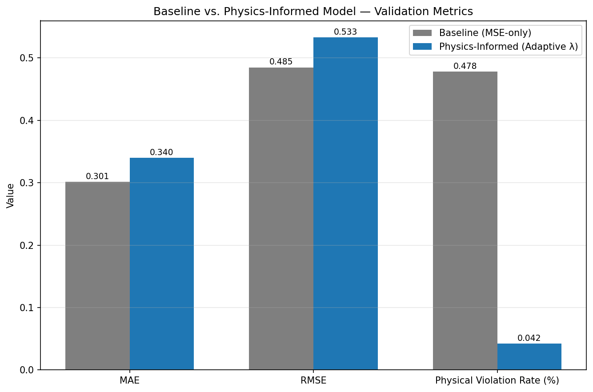

<div align="center">

# 🌊 Physics-Informed ConvLSTM for Satellite Climate Prediction

**Constraining deep learning with physical laws for more trustworthy climate forecasts**

[](https://www.python.org/)
[](https://pytorch.org/)
[](LICENSE)
[](https://www.ncei.noaa.gov/products/optimum-interpolation-sst)

*A hybrid deep learning system that predicts sea surface temperature from satellite time-series data — constrained by real physics (advection-diffusion PDEs) so the model can't predict physically impossible outcomes.*

</div>

---

## 🎯 Overview

Purely data-driven CNNs and ConvLSTMs are powerful at pattern matching, but they have no concept of physical law. Left unconstrained, they can predict outcomes that violate basic physics — negative rainfall, spontaneous energy creation, or discontinuous jumps that no real fluid system would produce.

This project injects a physical constraint directly into the training loss of a ConvLSTM forecasting model:

$$\mathcal{L}_{\text{total}} = \mathcal{L}_{\text{MSE}} + \lambda \, \mathcal{L}_{\text{physics}}$$

where $\mathcal{L}_{\text{physics}}$ penalizes violations of a 2D advection-diffusion PDE, and $\lambda$ is **adaptively scheduled** during training — starting at zero (so the model first learns basic data patterns) and ramping up only once training has stabilized (so physics acts as a refinement, not a distraction).

The model is trained and evaluated on **real NOAA OISST satellite sea surface temperature data**, with a full ablation study comparing the physics-informed model against a pure-MSE baseline.

## 📊 Key Results

An ablation study was run comparing an identical ConvLSTM architecture trained with **MSE-only loss** (baseline) vs. **MSE + adaptive physics loss** (physics-informed), on the same real NOAA OISST data and train/val split.

| Metric | Baseline (MSE-only) | Physics-Informed | Change |
|---|---|---|---|
| MAE | 0.3014 | 0.3400 | +12.8% |
| RMSE | 0.4848 | 0.5331 | +10.0% |
| **Physical Violation Rate** | **0.478%** | **0.043%** | **−91% (11× fewer violations)** |



### What this actually shows

The physics-informed model does **not** win on raw MAE/RMSE — and this project reports that honestly rather than cherry-picking a flattering run. What it *does* show is the real value proposition of physics-informed learning: **an 11× reduction in physically implausible predictions**, at a modest ~10–13% cost in raw pointwise error. For applications where physical plausibility matters as much as average accuracy (e.g. downstream models that assume conservation laws hold), that tradeoff is often worth making.

This result also surfaced and led to fixing a real bug: an early version of the physics loss was **numerically unscaled** relative to MSE, causing the physics-weighted model to diverge once $\lambda$ ramped up (RMSE ballooned to 3.4, a −208% "improvement"). The fix — normalizing the physics residual's magnitude to match MSE's scale before applying $\lambda$ — is what produced the stable, interpretable result above. See [`models/pinn_loss.py`](models/pinn_loss.py) for the corrected implementation.

## 🏗️ Architecture

**Model**: A stacked ConvLSTM encoder-decoder that ingests a sequence of past satellite frames and autoregressively forecasts future frames.

- **Encoder**: Processes `SEQ_LEN` input timesteps through 3 stacked ConvLSTM layers, accumulating spatiotemporal hidden state.
- **Decoder**: Autoregressively generates `PRED_LEN` future frames, feeding each prediction back in as the next input.

**Physics constraint**: The loss includes the residual of the 2D advection-diffusion PDE:

$$\frac{\partial C}{\partial t} + u\frac{\partial C}{\partial x} + v\frac{\partial C}{\partial y} = D\left(\frac{\partial^2 C}{\partial x^2} + \frac{\partial^2 C}{\partial y^2}\right)$$

computed via finite differences directly on the model's predicted sequence, plus a non-negativity penalty for physically bounded quantities (e.g. rainfall, energy).

**Adaptive λ schedule**: $\lambda$ stays at 0 for the first `LAMBDA_WARMUP_EPOCHS`, then linearly ramps to `LAMBDA_MAX` over `LAMBDA_RAMP_EPOCHS` — letting the model master basic data patterns before physics constraints are enforced.

```
Input sequence (T frames) → ConvLSTM Encoder → Hidden State
                                                      ↓
                              ConvLSTM Decoder → Predicted sequence (T' frames)
                                                      ↓
                    ┌─────────────────────────────────┴─────────────────────────┐
                    ↓                                                           ↓
              MSE(pred, target)                              PDE residual + non-negativity penalty
                    └─────────────────────────┬─────────────────────────────────┘
                                               ↓
                              L_total = L_MSE + λ(epoch) · L_physics
```

## 📁 Project Structure

```
pinn-climate/
├── config.py                      # Central hyperparameter configuration
├── train.py                       # Main training loop with CSV logging
├── evaluate.py                    # Standalone checkpoint evaluation
├── ablation_study.py              # Baseline vs. physics-informed comparison
├── smoke_test.py                  # End-to-end pipeline sanity check
├── visualize_predictions.py       # Prediction vs. ground truth plots
├── plot_training_history.py       # Training curve plots
├── requirements.txt
├── data/
│   ├── dataset.py                 # NetCDF dataset loader
│   ├── generate_synthetic_data.py # Synthetic SST data for pipeline testing
│   └── download_noaa_data.py      # Real NOAA OISST data downloader (ERDDAP)
├── models/
│   ├── convlstm.py                # Stacked ConvLSTM encoder-decoder
│   └── pinn_loss.py                # Physics-informed loss + adaptive λ scheduler
├── utils/
│   ├── metrics.py                 # MAE, RMSE, physical violation rate
│   └── visualization.py           # Plotting utilities
├── checkpoints/                   # Saved model weights (generated)
├── logs/                          # Training history CSVs (generated)
└── outputs/                       # Generated plots and results (generated)
```

## 🚀 Setup & Usage

### 1. Install dependencies
```bash
pip install -r requirements.txt
```

### 2. Get data

**Option A — real NOAA satellite data:**
```bash
python data/download_noaa_data.py --date_start 2023-01-01 --date_end 2023-06-30
```

**Option B — synthetic data (for quick pipeline testing):**
```bash
python data/generate_synthetic_data.py --time_steps 200 --height 64 --width 64
```

Update `DATA_PATH` in `config.py` to match whichever file you generated.

### 3. Train
```bash
python train.py
```
Saves the best checkpoint to `checkpoints/best_model.pt` and logs metrics to `logs/history.csv`.

### 4. Evaluate
```bash
python evaluate.py
```

### 5. Visualize
```bash
python plot_training_history.py       # loss / MAE / RMSE / λ schedule curves
python visualize_predictions.py       # predicted vs. ground truth fields
```

### 6. Run the ablation study (baseline vs. physics-informed)
```bash
python ablation_study.py
```
Produces `outputs/ablation_comparison.png` and `outputs/ablation_results.csv`.

## 🛠️ Tech Stack

- **PyTorch** — model implementation and training
- **xarray + netCDF4** — satellite climate data (NetCDF format) handling
- **NOAA OISST v2.1** — real satellite-derived sea surface temperature data, via [NCEI ERDDAP](https://www.ncei.noaa.gov/erddap/index.html)
- **scipy** — spatial resampling
- **matplotlib** — visualization

## 🌐 Data Source

Real sea surface temperature data is sourced from NOAA's **Optimum Interpolation Sea Surface Temperature (OISST) v2.1** dataset — a quarter-degree daily global product blending satellite and in-situ observations, accessed via NOAA's public ERDDAP server (no API key required).