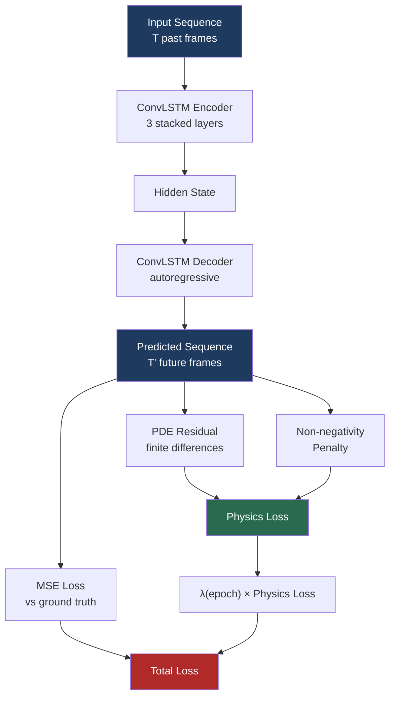
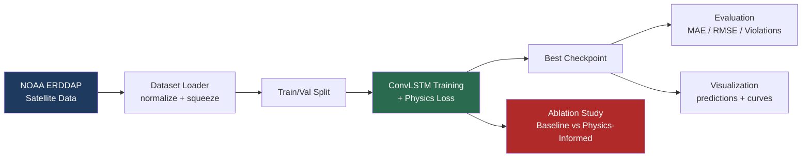

# 🌊 Physics-Informed ConvLSTM for Satellite Climate Prediction

**Constraining deep learning with physical laws for more trustworthy climate forecasts**

*A hybrid deep learning system that predicts sea surface temperature from satellite time-series data — constrained by real physics (advection-diffusion PDEs) so the model can't predict physically impossible outcomes.*

<!-- 🖼️ PLACEHOLDER: Hero/banner image (AI-generated) -->
<!--  -->

---

## 📑 Table of Contents

1. [Overview](#-overview)
2. [Problem & Motivation](#-problem--motivation)
3. [Features](#-features)
4. [Architecture & Workflow](#-architecture--workflow)
5. [Tech Stack](#-tech-stack)
6. [Project Structure](#-project-structure)
7. [Setup & Usage](#-setup--usage)
8. [Examples](#-examples)
9. [Results & Evaluation](#-results--evaluation)
10. [Testing](#-testing)
11. [Limitations](#-limitations)
12. [Lessons Learned](#-lessons-learned)
13. [Future Improvements / Roadmap](#-future-improvements--roadmap)
14. [License & Acknowledgments](#-license--acknowledgments)

---

## 🎯 Overview

Purely data-driven CNNs and ConvLSTMs are powerful at spatiotemporal pattern matching, but they have no built-in concept of physical law. Left unconstrained, they can predict outcomes that violate basic physics — negative rainfall, spontaneous energy creation, or discontinuous jumps that no real fluid system would produce.

This project injects a physical constraint directly into the training loss of a ConvLSTM forecasting model trained on **real NOAA satellite sea surface temperature (SST) data**:

$$\mathcal{L}_{\text{total}} = \mathcal{L}_{\text{MSE}} + \lambda \, \mathcal{L}_{\text{physics}}$$

where $\mathcal{L}_{\text{physics}}$ penalizes violations of a 2D advection-diffusion PDE, and $\lambda$ is **adaptively scheduled** during training — starting at zero so the model first learns basic data patterns, then ramping up only once training has stabilized.

The project includes a full **ablation study** comparing this physics-informed model against a pure-MSE baseline, with results reported honestly — including a tradeoff, not just a win.

---

## ❓ Problem & Motivation

**The problem:** Standard deep learning forecasters optimize purely for pointwise accuracy (MSE/MAE). This means nothing stops them from producing predictions that are statistically close to correct but physically nonsensical — a serious issue for downstream systems (e.g. hydrology models, energy balance calculations) that assume physical laws hold.

**The motivation:** Physics-Informed Neural Networks (PINNs) address this by embedding domain knowledge — in this case, a PDE governing heat/mass transport — directly into the loss function. This project explores:

- Whether a physics-constrained loss measurably reduces physically implausible predictions on **real satellite data** (not synthetic toy data).
- What the actual **accuracy tradeoff** looks like when physics constraints are added.
- The practical engineering challenges of combining PDE residuals with standard deep learning losses (which turned out to include a real numerical bug — see [Lessons Learned](#-lessons-learned)).

---

## ✨ Features

- 🛰️ **Real satellite data pipeline** — downloads live NOAA OISST v2.1 sea surface temperature data via NCEI's public ERDDAP server (no API key required).
- 🧠 **ConvLSTM encoder-decoder** — stacked spatiotemporal architecture for sequence-to-sequence forecasting.
- ⚖️ **Physics-informed hybrid loss** — MSE combined with a finite-difference advection-diffusion PDE residual and a non-negativity penalty.
- 📈 **Adaptive λ scheduling** — physics loss weight ramps up only after the model masters basic data patterns, avoiding early-training instability.
- 🔬 **Controlled ablation study** — trains an identical baseline (MSE-only) and physics-informed model on the same data/seed/split for a fair, quantified comparison.
- 📊 **Full evaluation suite** — MAE, RMSE, and a custom **Physical Violation Rate** metric measuring physically impossible predictions.
- 🎨 **Auto-generated visualizations** — training curves, prediction-vs-ground-truth comparisons, and ablation bar charts.
- 🧪 **End-to-end smoke test** — validates the full pipeline (data → model → loss → backprop) in under a minute before committing to long training runs.
- ☁️ **Colab-ready** — designed to run on free GPU runtimes with Google Drive persistence.

---

## 🏗️ Architecture & Workflow

### Model Architecture

A stacked **ConvLSTM encoder-decoder** ingests a sequence of past satellite frames and autoregressively forecasts future frames.

- **Encoder**: Processes `SEQ_LEN` input timesteps through 3 stacked ConvLSTM layers, accumulating spatiotemporal hidden state.
- **Decoder**: Autoregressively generates `PRED_LEN` future frames, feeding each prediction back in as the next input.

### Physics Constraint

The loss includes the residual of the 2D advection-diffusion PDE, computed via finite differences directly on the model's predicted sequence:

$$\frac{\partial C}{\partial t} + u\frac{\partial C}{\partial x} + v\frac{\partial C}{\partial y} = D\left(\frac{\partial^2 C}{\partial x^2} + \frac{\partial^2 C}{\partial y^2}\right)$$

plus a non-negativity penalty for physically bounded quantities (e.g. rainfall, energy).

<!-- 🖼️ PLACEHOLDER: AI-generated conceptual diagram illustrating "data-driven vs physics-constrained prediction" -->
<!--  -->

### Model & Loss Flow

### Adaptive λ Schedule

$\lambda$ stays at 0 for the first `LAMBDA_WARMUP_EPOCHS`, then linearly ramps to `LAMBDA_MAX` over `LAMBDA_RAMP_EPOCHS` — letting the model master basic data patterns before physics constraints are enforced.

### End-to-End Pipeline

---

